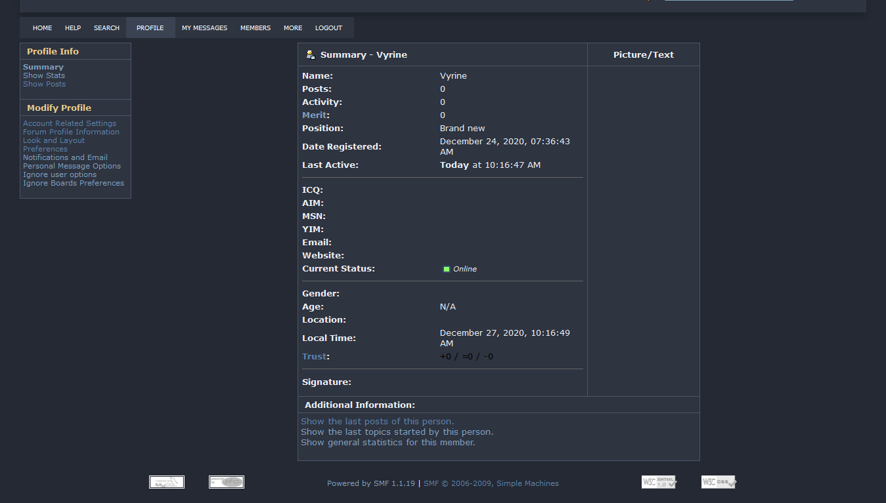

<h2 align="center">Nord Theme for Bitcointalk 🖤</h2>

Based on [Nord](https://www.nordtheme.com/). An arctic, north-bluish color palette.

[Preview](#preview)

[Installation](#installation)

## Preview

## Installation

1. Install [Stylus for Firefox](https://addons.mozilla.org/en-US/firefox/addon/styl-us/), [Chrome](https://chrome.google.com/webstore/detail/stylus/clngdbkpkpeebahjckkjfobafhncgmne), [Opera](https://addons.opera.com/en-gb/extensions/details/stylus/) or [Cascadea for Safari](https://cascadea.app/).
2. Install [nord-bitcointalk.user.css](https://raw.githubusercontent.com/Flame-0/nord-bitcointalk/main/nord-bitcointalk.user.css).
